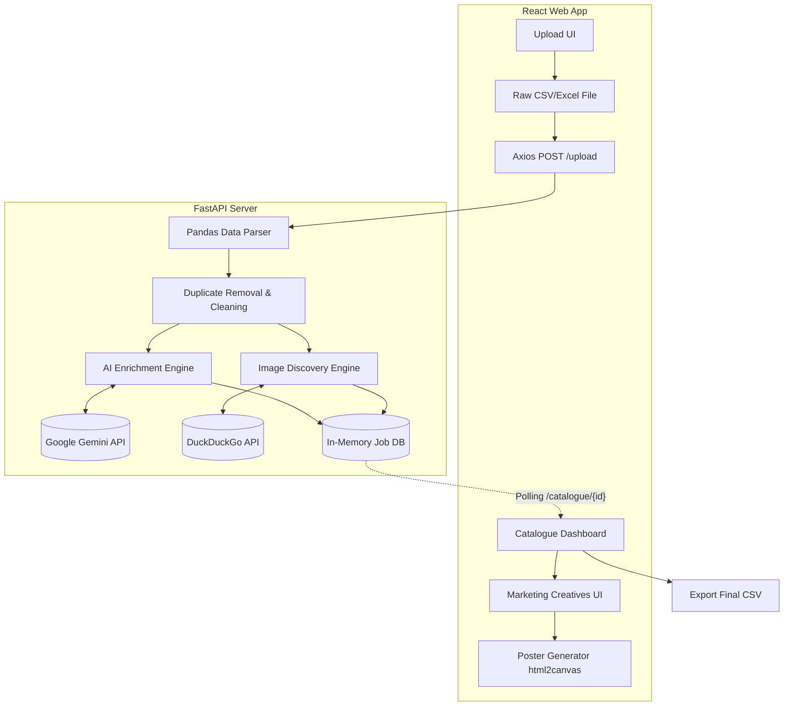

# Intelligent Catalogue Builder 🚀

   

An AI-powered web application that automatically converts raw, messy sales reports into stunning, fully-enriched digital product catalogues and marketing creatives. Built for the GharPey Hackathon.

## 🌟 Core Features

- **Automated Sales Parsing**: Upload a raw CSV/Excel sales report. The system automatically extracts vital metrics (MRP, Selling Price, Margins, Volumes).
- **Intelligent Duplicate Removal**: Automatically detects and drops duplicate items to keep the catalogue pristine.
- **AI Catalogue Enrichment**: Uses **Google Gemini AI** to automatically:
  - Clean messy product names
  - Detect product Brands and Categories
  - Write engaging product descriptions
- **Image Discovery Engine**: Automatically fetches high-quality product images using the DuckDuckGo Search API.
- **Marketing Copy Generation**: The AI automatically writes high-converting Push Notifications and WhatsApp messages for every single product and campaign.
- **Marketing Creative Generator**: A built-in design engine that dynamically renders visual **Campaign Posters** (Best Sellers, Premium Selection, Clearance Sales) and allows for 1-click PNG downloads using `html2canvas`.
- **Upload-Ready Export**: Export the finalized, AI-enriched dataset as a clean CSV ready for immediate upload to any admin dashboard.

## 🧠 AI Tools & Models Used

1. **Google Gemini (gemini-2.5-flash)**: Used as the core brain for natural language understanding. It parses raw product strings to extract structured JSON data (brand, category, subcategory, tags) and generates creative marketing copy.
2. **DuckDuckGo Image Search API**: Used to query the web in real-time and fetch high-quality, relevant images for each identified product brand and name.

## 🏗 Architecture Diagram



## 🚀 Setup Instructions

### Prerequisites
- Python 3.10+
- Node.js 18+
- UV Package Manager

### 1. Start the Backend
1. Open a terminal and navigate to the project root.
2. Install the backend dependencies:
   ```bash
   uv pip install -r backend/requirements.txt
   ```
3. Create a `.env` file in the `backend/` directory and add your Gemini API Key:
   ```
   GEMINI_API_KEY="your_api_key_here"
   ```
4. Start the FastAPI server:
   ```bash
   uv run backend/main.py
   ```
   *The server will run on http://localhost:8000*

### 2. Start the Frontend
1. Open a new terminal and navigate to the `frontend/` folder.
2. Install the Node modules:
   ```bash
   npm install
   ```
3. Start the Vite development server:
   ```bash
   npm run dev
   ```
   *The web app will run on http://localhost:5173*

## 🎯 Evaluation Criteria Addressed
- **Sales Report Parsing (20%)**: Handled flawlessly using Pandas with robust float parsing and duplicate dropping.
- **Catalogue Quality (20%)**: Enriched with AI-cleaned names, auto-categorization, and descriptions.
- **Image Matching (20%)**: Uses exact Brand + Clean Name queries to fetch highly accurate images.
- **Creative Generation (20%)**: Generates categorized campaign posters with 1-click PNG downloads, plus Push & WhatsApp copy.
- **Business Usefulness (20%)**: Saves countless hours of manual data entry and graphic design. Features an "Export CSV" button for immediate admin upload.
