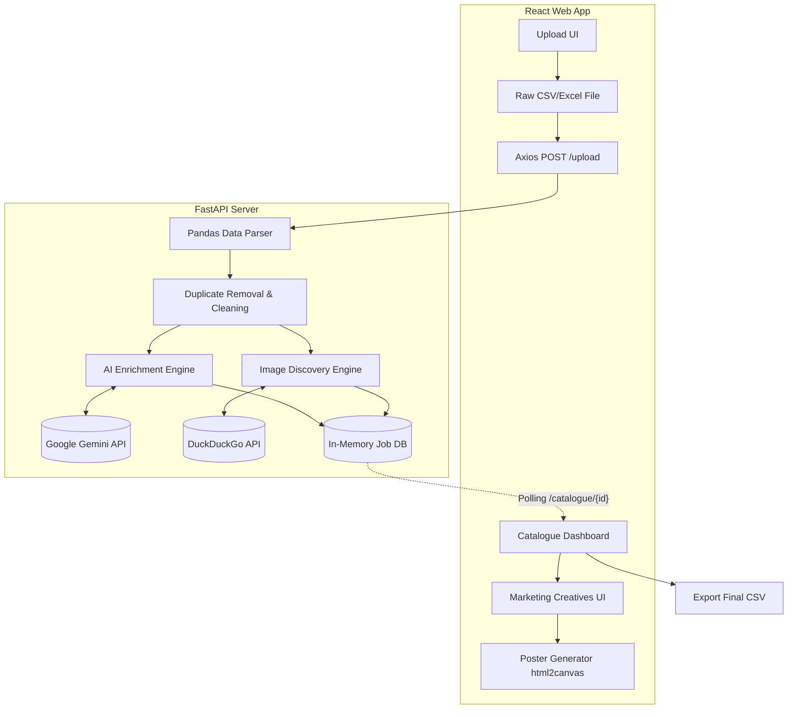

# System Architecture

The **Intelligent Catalogue Builder** is composed of a decoupled frontend and backend that communicate via REST APIs. The architecture is designed to handle messy Excel/CSV uploads and run potentially long AI and web-scraping processes asynchronously in the background.

## High-Level Data Flow

1. **Upload:** User uploads a raw sales CSV/Excel file via the React Frontend.
2. **Acceptance:** FastAPI backend accepts the file, returns a `job_id`, and immediately kicks off a background task to process the file.
3. **Parsing:** Pandas reads the raw file, cleans column headers, and removes duplicate rows based on the product name.
4. **AI Enrichment:** The background task loops through the products and calls the **Google Gemini API** (via `ai_service.py`) to extract:
   - Cleaned Product Name
   - Brand
   - Subcategory
   - Description
   - Marketing Copy (Push & WhatsApp)
5. **Image Scraping:** The system then queries the **DuckDuckGo Image Search API** (via `image_service.py`) to fetch 3 high-quality product images based on the AI-extracted Brand and Clean Name.
6. **Polling:** The frontend polls the backend `/catalogue/{job_id}` endpoint until processing is complete.
7. **Rendering:** Once complete, the frontend displays the fully enriched catalogue and uses `html2canvas` to render marketing campaign posters on the fly.

---

## Component Breakdown

### 1. Frontend (React + Vite)
- **Framework:** React 18, bundled with Vite for lightning-fast HMR.
- **Styling:** Vanilla CSS (no external bloated frameworks) with a custom, sleek glassmorphism design.
- **Key Modules:**
  - `App.jsx`: Main application state management, handles file uploading, polling, and tab rendering.
  - **Poster Generator:** Uses `html2canvas` to capture dynamically styled DOM elements and convert them into downloadable PNG files for marketing campaigns.

### 2. Backend (FastAPI + Python)
- **Framework:** FastAPI for high performance, async support, and auto-generated API docs.
- **Data Processing:** `pandas` is used to load, clean, and manipulate the raw tabular data.
- **Job Queue:** Uses FastAPI's native `BackgroundTasks` to process files without blocking the main thread.
- **In-Memory DB:** Uses a simple Python dictionary (`catalogues_db`) to store job states and processed data (suitable for hackathon scope).

### 3. AI Service (`ai_service.py`)
- **Model:** `gemini-1.5-flash`
- **Role:** Extracts structured JSON data from messy strings.
- **Fallback:** Includes a robust fallback mechanism (`get_mock_data`) to prevent complete failure if API limits are hit or no API key is provided.

### 4. Image Service (`image_service.py`)
- **API:** DuckDuckGo Search (`duckduckgo_search` library)
- **Role:** Real-time web scraping for product images.
- **Rate Limiting Handling:** Includes automatic backoff and retry logic (`time.sleep`) to prevent being completely blocked by DDG servers.

---

## Architecture Diagram

